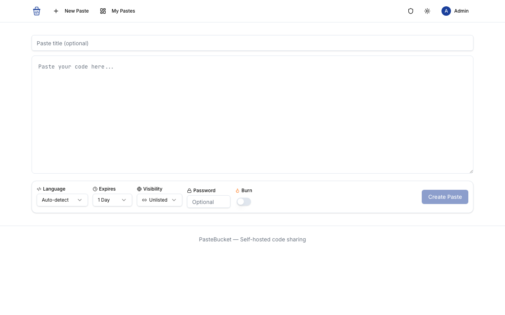
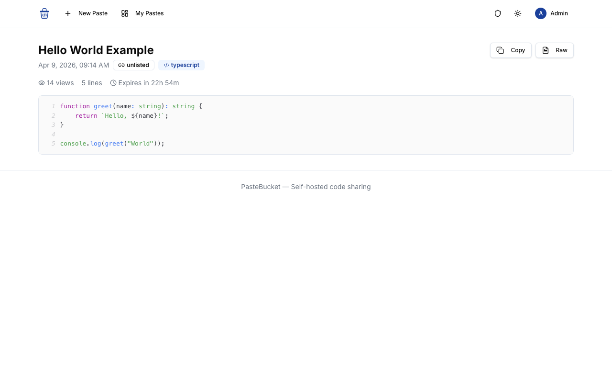
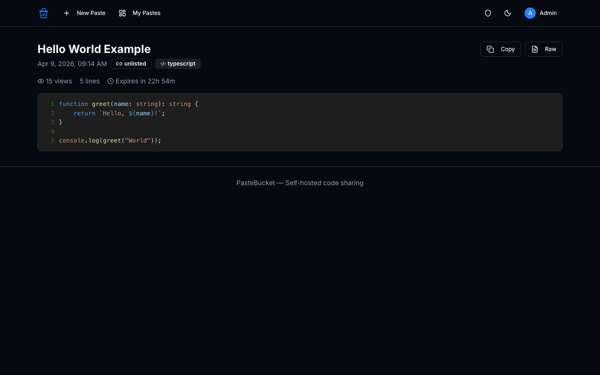
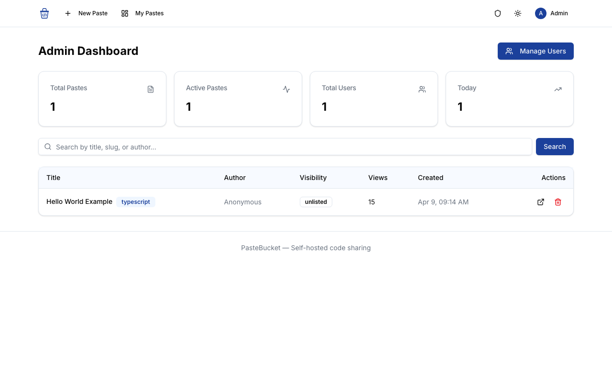
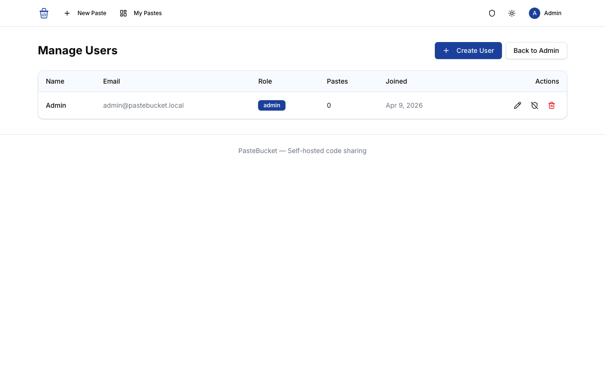

# PasteBucket

[](https://laravel.com)
[](https://react.dev)
[](https://www.typescriptlang.org)
[](https://tailwindcss.com)
[](https://opensource.org/licenses/MIT)

A self-hosted pastebin alternative built with Laravel and React. Share code snippets with syntax highlighting, password protection, expiry controls, and more.

> **Disclaimer:** This software is provided "as is", without warranty of any kind. Use at your own risk. The authors are not responsible for any data loss, security breaches, or other damages resulting from the use of this software. Always review the code and configure proper security measures before deploying to production.



## Features

- **Syntax Highlighting** - Auto-detection for 40+ languages with manual override. Powered by Prism via react-syntax-highlighter.
- **Light & Dark Mode** - Automatic theme switching based on system preference, with manual toggle. Syntax highlighting adapts instantly.
- **Password Protection** - Optionally protect any paste with a password (bcrypt hashed).
- **Burn After Read** - Self-destructing pastes that are deleted after first view.
- **Configurable Expiry** - Guests: 1 hour to 7 days. Logged-in users: up to 365 days. Defaults configurable via `.env`.
- **Visibility Controls** - Public, unlisted, or private (login required) pastes.
- **Secure URLs** - 16-character random slugs for unpredictable paste URLs.
- **No Character Limit** - Designed for sharing long code snippets with preserved structure.
- **Admin Panel** - Dashboard with stats, paste management, user management (create/edit/delete), and role toggling.
- **Responsive Design** - Fully responsive layout for mobile, tablet, and desktop.
- **Tab Support** - Tab key inserts actual tab characters in the editor.
- **Passkey Authentication** - Sign in with Face ID, Touch ID, or Windows Hello via WebAuthn. Manage passkeys from the dashboard.
- **Raw View** - Access raw paste content at `/p/{slug}/raw`.

## Screenshots

### Create Paste


### View Paste (Light)


### View Paste (Dark)


### Admin Dashboard


### User Management


## Tech Stack

- **Backend**: Laravel 13, PHP 8.2+
- **Frontend**: React 19, TypeScript, Inertia.js v3
- **UI Components**: shadcn/ui (Radix UI + Tailwind CSS v4)
- **Syntax Highlighting**: react-syntax-highlighter (Prism)
- **Database**: MySQL/PostgreSQL/SQLite

## Installation

### Requirements

- PHP 8.2+
- Composer
- Node.js 18+
- MySQL 8.0+ / PostgreSQL 14+ / SQLite

### Local Development

```bash
# Clone the repository
git clone https://github.com/kayvanaarssen/pastebucket.git
cd pastebucket

# Install PHP dependencies
composer install

# Install Node dependencies
npm install

# Copy environment file and generate key
cp .env.example .env
php artisan key:generate

# Configure your database in .env
# For SQLite (default):
touch database/database.sqlite

# For MySQL:
# DB_CONNECTION=mysql
# DB_HOST=127.0.0.1
# DB_PORT=3306
# DB_DATABASE=pastebucket
# DB_USERNAME=root
# DB_PASSWORD=

# Run migrations
php artisan migrate

# Create an admin user
php artisan make:admin "Admin" "admin@example.com" "your-password"

# Build frontend assets
npm run build

# Start development servers
php artisan serve
npm run dev
```

## Deploying with Ploi

### 1. Create a New Site

- In Ploi, create a new site pointing to your domain
- Set the web directory to `/public`
- Select PHP 8.2+ as the PHP version

### 2. Connect Repository

- Go to your site's **Repository** tab
- Connect to `github.com/kayvanaarssen/pastebucket`
- Set branch to `main`
- Enable **Install Composer dependencies**

### 3. Deploy Script

Replace the default deploy script with:

```bash
cd {SITE_DIRECTORY}
git pull origin main

composer install --no-interaction --prefer-dist --optimize-autoloader --no-dev

npm ci
npm run build

php artisan migrate --force
php artisan config:cache
php artisan route:cache
php artisan view:cache

echo "Application deployed!"
```

### 4. Environment Variables

In the **Environment** tab, update your `.env`:

```env
APP_NAME=PasteBucket
APP_ENV=production
APP_DEBUG=false
APP_URL=https://your-domain.com

DB_CONNECTION=mysql
DB_HOST=127.0.0.1
DB_PORT=3306
DB_DATABASE=pastebucket
DB_USERNAME=your_db_user
DB_PASSWORD=your_db_password

# PasteBucket Settings
PASTE_GUEST_MAX_EXPIRY_HOURS=168
PASTE_USER_MAX_EXPIRY_HOURS=8760
PASTE_DEFAULT_EXPIRY_HOURS=24
PASTE_CLEANUP_ENABLED=true
```

### 5. Create Admin User

SSH into your server (or use Ploi's **Terminal**) and run:

```bash
cd {SITE_DIRECTORY}
php artisan make:admin "Admin" "admin@example.com" "your-secure-password"
```

### 6. Schedule Expired Paste Cleanup

In Ploi's **Cronjobs** tab, add:

```
* * * * * cd {SITE_DIRECTORY} && php artisan schedule:run >> /dev/null 2>&1
```

Or add a specific cron for paste cleanup:

```
0 * * * * cd {SITE_DIRECTORY} && php artisan pastes:clean >> /dev/null 2>&1
```

### 7. SSL

Enable **Let's Encrypt** SSL in Ploi's **SSL** tab for your domain.

## Configuration

All paste settings are configurable via environment variables:

| Variable | Default | Description |
|---|---|---|
| `PASTE_GUEST_MAX_EXPIRY_HOURS` | `168` (7 days) | Maximum expiry for guest pastes |
| `PASTE_USER_MAX_EXPIRY_HOURS` | `8760` (365 days) | Maximum expiry for logged-in users |
| `PASTE_DEFAULT_EXPIRY_HOURS` | `24` (1 day) | Default expiry for new pastes |
| `PASTE_CLEANUP_ENABLED` | `true` | Enable automatic expired paste cleanup |

## Artisan Commands

```bash
# Create an admin user
php artisan make:admin {name} {email} {password}

# Clean up expired pastes
php artisan pastes:clean
```

## License

This project is licensed under the MIT License - see the [LICENSE](LICENSE) file for details.

**USE AT YOUR OWN RISK.** The authors assume no liability for any damages or issues arising from the use of this software.
